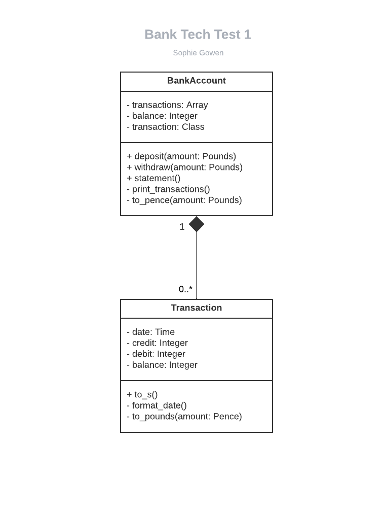
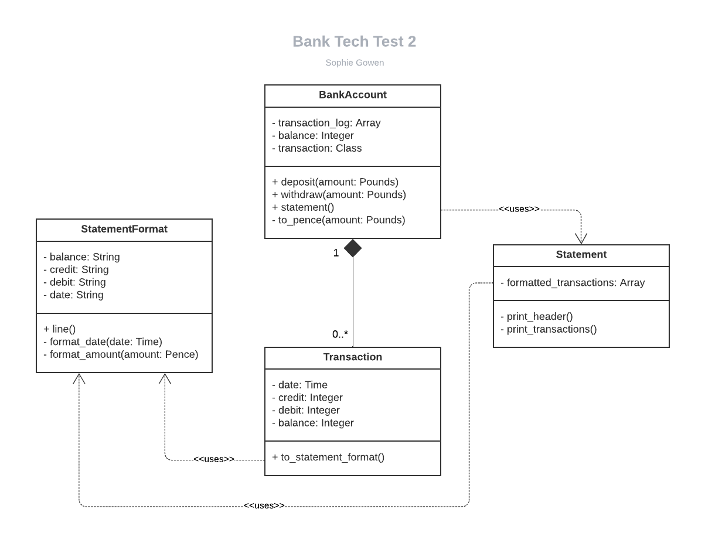
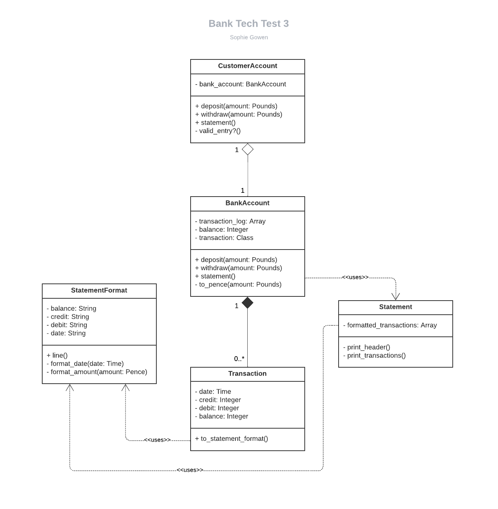

# Bank Tech Test

As part of our code quality week at Makers we have been tasked with employing exemplary TDD processes in creating a program mimicking a bank account to the specifications which can be found below. Read on to see if you think I have succeeded.

## Installation
---
```
$ git clone https://github.com/SoJGo/bank-tech-test.git
$ cd bank-tech-test
$ bundle
```

## Tests
---
```
$ rspec
```
Or use the following for documentation format:
```
$ rspec -fd
```

## Linting
---
```
$ rubocop
```

## Usage
---
```ruby
You@YourComputer bank_tech_test $ irb      
 :001 > require './lib/customer_account'
 => true 
 :002 > my_account = CustomerAccount.new
 => #<CustomerAccount:0x0000000113574f18 @bank_account=#<BankAccount:0x0000000113574e78 @balance=0, @transaction=Transaction, @transaction_log=[]>> 
 :003 > my_account.deposit(13)
 => "£13.00 deposited. Thank you for banking with us." 
 :004 > my_account.deposit(42.00)
 => "£42.00 deposited. Thank you for banking with us." 
 :005 > my_account.withdraw(7)
 => "£7.00 withdrawn. Thank you for banking with us." 
 :006 > my_account.statement
date || credit || debit || balance
31/12/1999 || || 7.00 || 48.00                                 
31/12/1999 || 42.00 || || 55.00                                
31/12/1999 || 13.00 || || 13.00                                
 => "Thank you for banking with us. Have a lovely day now."                           
```

## Specification
---

### Requirements

* You should be able to interact with your code via a REPL like IRB or Node.  (You don't need to implement a command line interface that takes input from STDIN.)
* Deposits, withdrawals.
* Account statement (date, amount, balance) printing.
* Data can be kept in memory (it doesn't need to be stored to a database or anything).

### Acceptance criteria

- **Given** a client makes a deposit of 1000 on 10-01-2023  
- **And** a deposit of 2000 on 13-01-2023  
- **And** a withdrawal of 500 on 14-01-2023  
- **When** she prints her bank statement  
- **Then** she would see:

```
date || credit || debit || balance
14/01/2023 || || 500.00 || 2500.00
13/01/2023 || 2000.00 || || 3000.00
10/01/2023 || 1000.00 || || 1000.00
```
## Process
---
This is a real opportunity to put our TDD to the T. As such I will be following a truly test first process, making use of diagramming when refactoring my code. I will use the following table as a reference for writing my tests.

| Input                          | Output |
| -----------                    | ----------- |
| (Before each do:               | my_account = BankAccount.new) |
||
| my_account.statement           | date \|\| credit \|\| debit \|\| balance   |
||
||
| my_account.deposit(1000.00)    | date \|\| credit \|\| debit \|\| balance   |
| my_account.statement           | 10/01/2023 \|\| 1000.00 \|\| \|\| 1000.00  |
||
||
| my_account.deposit(1000.00)    | date \|\| credit \|\| debit \|\| balance   |
| my_account.deposit(2000.00)    | 13/01/2023 \|\| 2000.00 \|\| \|\| 3000.00  |
| my_account.statement           | 10/01/2023 \|\| 1000.00 \|\| \|\| 1000.00  |
||
||
| my_account.deposit(1000.00)    | date \|\| credit \|\| debit \|\| balance   |
| my_account.deposit(2000.00)    | 14/01/2023 \|\| \|\| 500.00 \|\| 2500.00   |
| my_account.withdraw(500.00)    | 13/01/2023 \|\| 2000.00 \|\| \|\| 3000.00  |
| my_account.statement           | 10/01/2023 \|\| 1000.00 \|\| \|\| 1000.00  |
||
||

At this juncture I thought carefully about refactoring and extracting into a Transaction class. I also introduced methods for converting the balance, credit and debit values to pence, storing them as integers to avoid a cumulative skew from float inaccuracy. These figures are then only converted back when necessary for display purposes, as below:

<div align="center">
  
</div>

My next step in refactoring was to extract a Statement class that would be responsible for the output of the statement to the terminal. I also introduced a StatementFormat class which wraps the raw data from the Transaction instance and converts it to presentable strings. Both of these classes are injected when calling the to_statement_format method on a transaction, with the aim of making changing output formatting a thing of ease. The array that is then passed to the Statement class upon initialization is full of StatementFormat instances, which return a formatted line of the statement when the line method is called on them. I thought this was quite a tidy way of managing information for presentation without exposing the raw data in a transaction.
<div align="center">
  
</div>

I went on to create a CustomerAccount class to act as the interface for the user, leaving the BankAccount class to store the transactions and balance and communicate with the other classes. The CustomerAccount is now responsible for ensuring that the customer's input is valid. This is currently set up as a one to one relationship with the BankAccount, but could easily be adapted to use the CustomerAccount to hold various different accounts belonging to an individual.
<div align="center">
  
</div>

## Good Points
---
- Testing including feature tests is 100%
- Testing with just unit tests is +99%
- Successfully linted using Rubocop

## Points for consideration
---
- Specification makes no mention of an overdraft limit, I would query this as it is currently far too good a bank account to have.
- CustomerAccount could be modified as a future feature, to hold a selection of accounts, with the individual specifying which one to access at the time.